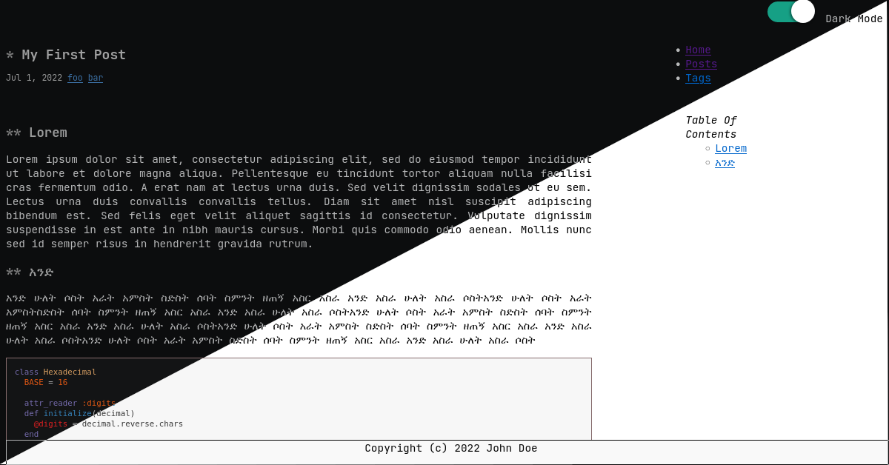
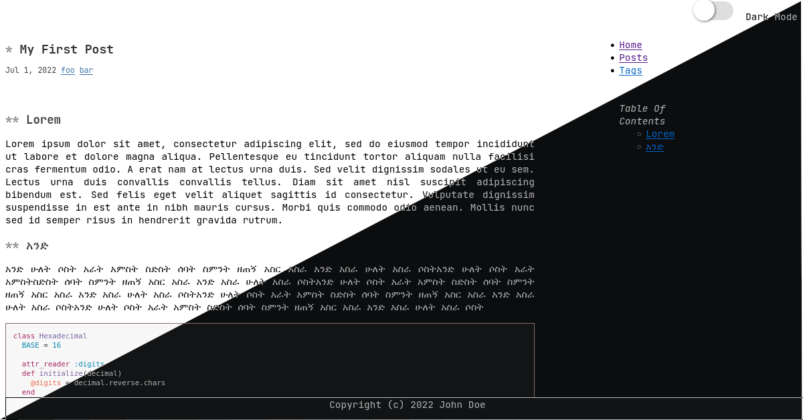
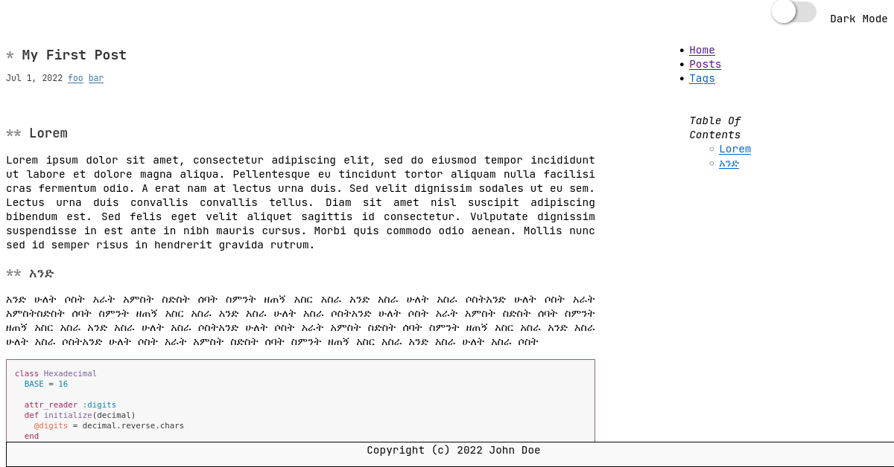
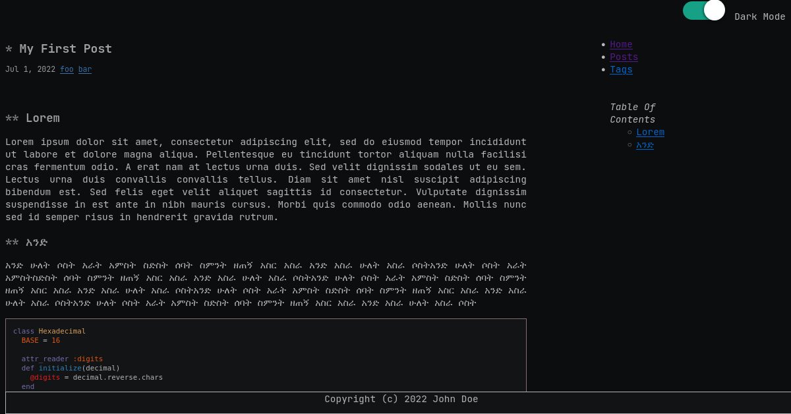

# termishTheme
A minimal hugo theme with dark-mode support designed from the groundup to look and feel like texteditor.

Note: Currently it is a working progress.

Look and feel

 (screenshot 1)
 
   
 (screenshot 2)
    
 (screenshot 3)
    
 (screenshot 4)
    
