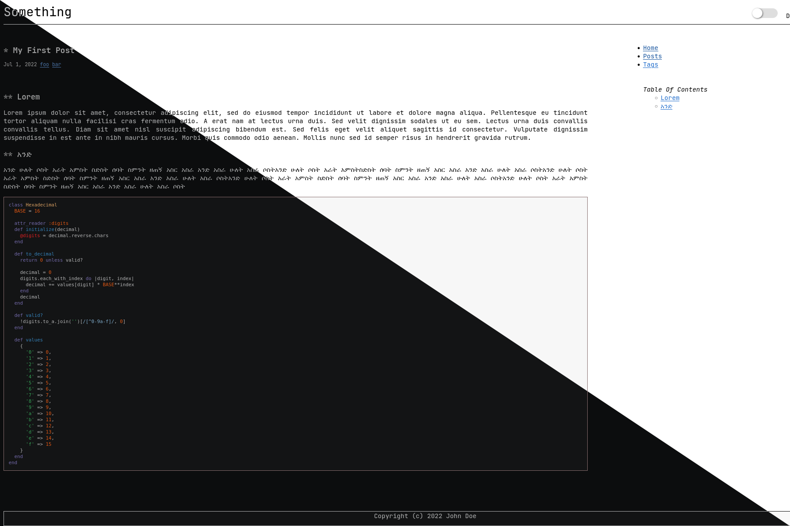

# termishTheme
A minimal hugo theme with dark-mode support designed from the groundup to look and feel like text-editor. Especially anybody who is familiar with org-mode in emacs will feel right at home.

It is a theme designed to be minimal, simple and nice to look at especially if you are comfortable with monospace fonts. It is designed to work well even when javascript is disabled or when reading from a text only browser like lynx. It is also a good theme to base your theme on.

Note: Any feedback and additions are welcome.

 (screenshot of termishTheme)
